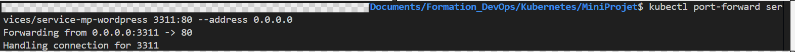

# mini-proj-k8s
----------------------------Create PV ---------------------
kubectl create -f pv.yaml

persistentvolume/mysql-pv-mp created

----------------------------Create PVC ---------------------

kubectl create -f pvc.yaml

persistentvolumeclaim/mysql-pv-mp-claim created

----------------------------Mysql & Wordpress deployement---------------------

kubectl create -f mysql-deployment.yaml

deployment.apps/mysql created

kubectl apply -f wordpess.yaml 

deployment.apps/wordpress created

----------------------------Mysql  & Wordpress Services----------------------

kubectl create -f service-mysql.yml 

service/service-mp-mysql created

kubectl create -f service-wordpress.yml

service/service-mp-wordpress created

----------------------------Exposition du port ----------------------------

----------------------------Connexion à l'application----------------------------

