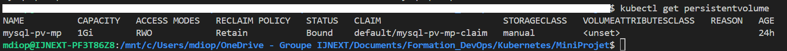

# mini-proj-k8s
----------------------------Create namespace ---------------------

kubectl create namespace production

----------------------------Create PV ---------------------

kubectl create -f pv.yaml -n production

persistentvolume/mysql-pv-mp created

----------------------------Create PVC ---------------------

kubectl create -f pvc.yaml -n production

persistentvolumeclaim/mysql-pv-mp-claim created

----------------------------Mysql & Wordpress deployement---------------------

kubectl create -f mysql-deployment.yaml -n production

deployment.apps/mysql created

kubectl apply -f wordpess-deployment.yaml -n production

deployment.apps/wordpress created

----------------------------Mysql  & Wordpress Services----------------------

kubectl create -f service-mysql.yml -n production

service/service-mp-mysql created

kubectl create -f service-wordpress.yml -n production

service/service-mp-wordpress created

----------------------------Connexion à l'application----------------------------

